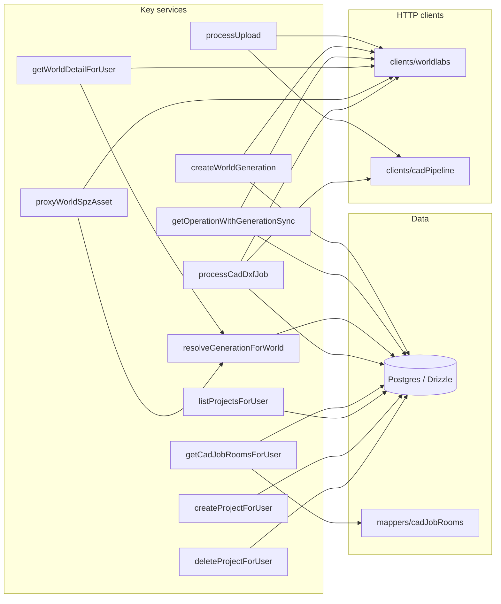
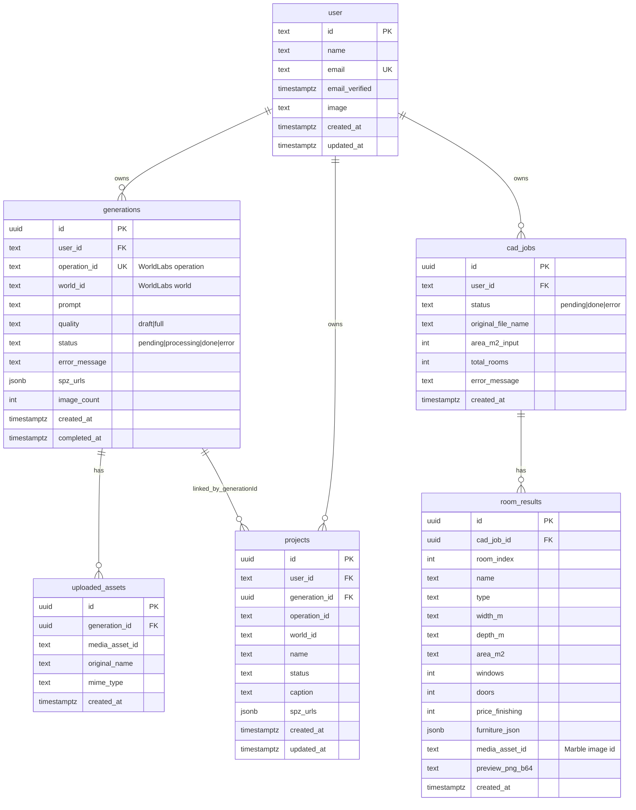
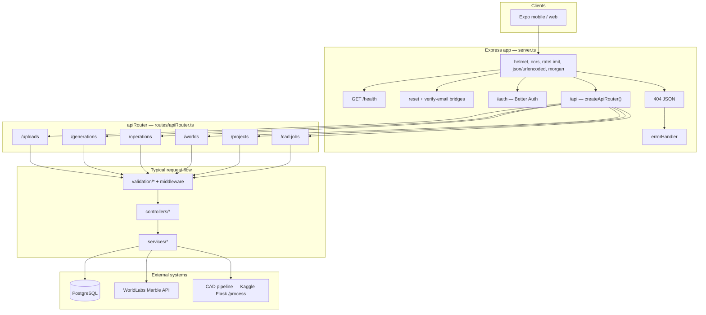
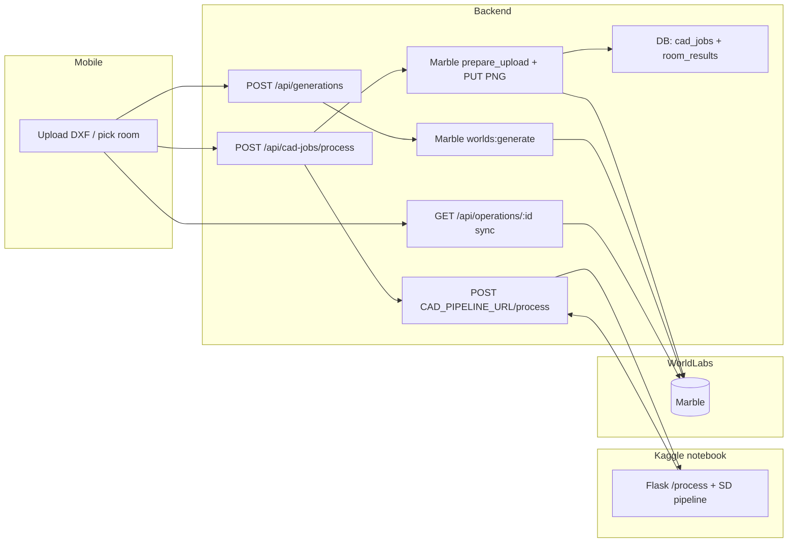

# Decor AI — Monorepo

Expo **mobile** app + Express **backend** that processes **AutoCAD DXF** floor plans (via a **Kaggle** GPU notebook), uploads room renders to **WorldLabs Marble**, and creates **navigable 3D worlds** from text + images.

---

## Repository layout

| Path | Purpose |
|------|---------|
| `backend/` | Express + TypeScript API, Drizzle ORM, Better Auth, WorldLabs + CAD HTTP clients |
| `mobile/` | Expo (React Native) client |
| `notebooks/Pre-Phase AI.ipynb` | **Kaggle** notebook: DXF pipeline, ControlNet/SD, Flask `/process` + **ngrok** tunnel |

---

## Prerequisites

On any PC that runs this stack:

- **Node.js** 20+ (LTS recommended) and npm
- **PostgreSQL** (e.g. [Neon](https://neon.tech) serverless) — URL goes in `DATABASE_URL`
- **WorldLabs Marble** API key — [WorldLabs](https://worldlabs.ai)
- **Kaggle** account (free GPU sessions) — for DXF → rooms + 2D renders
- **ngrok** free account + auth token — so your laptop/phone can reach the notebook’s Flask server over HTTPS

Optional: **Resend** for production email (password reset / verify-email); dev can stay minimal per `backend/.env.example`.

---

## Quick start (local)

### 1. Clone and install

```bash
git clone <your-fork-or-repo-url>
cd decor-ai
npm install --prefix backend
npm install --prefix mobile
```

### 2. Backend environment

```bash
cd backend
cp .env.example .env     # macOS / Linux / Git Bash
# Windows (cmd/PowerShell): copy .env.example .env
```

Fill at least:

- `DATABASE_URL`, `BETTER_AUTH_SECRET` (≥32 chars), `BETTER_AUTH_URL` (e.g. `http://localhost:4000`)
- `WORLDLABS_API_KEY`
- `CAD_PIPELINE_URL` — **after** you start the Kaggle notebook (see below); can be empty until you test CAD

### 3. Database migrations

From `backend/`:

```bash
npm run db:migrate
# If you need baselining on an existing DB, see package.json script `db:migrate:safe`
```

### 4. Run the API

From repo **root**:

```bash
npm run dev:backend
```

Health: [http://localhost:4000/health](http://localhost:4000/health)  
JSON API: mounted under **`/api/*`**. Auth routes: **`/auth`**.

### 5. Mobile app

```bash
cd mobile
cp .env.example .env
# Windows: copy .env.example .env
```

Set `EXPO_PUBLIC_API_URL` to the same host/port as `BETTER_AUTH_URL` (for a **physical device**, use your PC’s **LAN IP**, e.g. `http://192.168.1.42:4000`, not `localhost`).

From repo root:

```bash
npm run dev:mobile
npm run android   # or: npm run ios / npm run web
```

---

## Kaggle notebook + ngrok (CAD pipeline)

The backend **does not** run Stable Diffusion or parse DXF locally. It forwards DXF bytes to the notebook’s **`POST /process`** endpoint.

### Notebook cell order (`notebooks/Pre-Phase AI.ipynb`)

1. **Dependencies** — installs `ezdxf`, EasyOCR, diffusers, Flask, `pyngrok`, OpenCV, etc.
2. **Cell 1** — defines `run_pipeline()` (DXF → rooms, Canny edges, ControlNet + Realistic Vision).
3. **Cell 2** — loads GPU models + defines **Flask** app with:
   - `GET /health`
   - `POST /process` (multipart field **`dxf_file`**, form fields `area_m2`, `style`, `palette`)
4. **Next cell** — starts **ngrok** on port **5000**, prints  
   `CAD_PIPELINE_URL=https://….ngrok-free.app`  
   then runs `app.run(host="0.0.0.0", port=5000)`.

   *(If the API returns “start … Cell C”, that refers to this **ngrok + Flask** cell: keep it running.)*

### What you must do on another PC

1. Upload or sync **`Pre-Phase AI.ipynb`** to **Kaggle** (or run locally with GPU + public tunnel — same idea).
2. Create an **ngrok account** and copy your **authtoken** from [ngrok dashboard](https://dashboard.ngrok.com/get-started/your-authtoken).
3. In the **ngrok + Flask** cell, set **`NGROK_TOKEN`** to your token (**never commit real tokens** to git).
4. Run cells in order; keep the **last running cell** alive (Flask + tunnel). If Kaggle stops the session (~30 minutes on free tier), the URL changes — update **`CAD_PIPELINE_URL`** and restart the backend.
5. Paste the printed base URL into **`backend/.env`**:

   ```env
   CAD_PIPELINE_URL=https://xxxx.ngrok-free.app
   CAD_PIPELINE_TIMEOUT_MS=180000
   ```

6. Restart **`npm run dev:backend`**.  
   Test from the PC: `curl <CAD_PIPELINE_URL>/health` should return JSON `status: ok`.

### Contract with the backend

The Express client (`backend/src/clients/cadPipeline.ts`) calls:

`POST {CAD_PIPELINE_URL}/process`

- **multipart** file field: **`dxf_file`**
- **form fields**: `area_m2`, `style`, `palette`

Success JSON shape (simplified): `{ "rooms": [ { "id", "name", "generated_image_b64", … } ] }`  
Errors: `{ "error": "…" }` → backend surfaces as 5xx / error message.

---

## API surface (high level)

All routes below are **under** `/api` except **`/auth`** and bridge pages at server root.

| Mount | Resource |
|-------|----------|
| `/api/uploads` | Image (and DXF-through-pipeline) uploads, Marble `prepare_upload` |
| `/api/cad-jobs` | `POST /process` (DXF job), `GET /:jobId/rooms` |
| `/api/generations` | Start Marble world generation |
| `/api/operations` | Poll Marble operation + sync `generations` row |
| `/api/worlds` | World metadata |
| `/api/projects` | User projects |

Authentication: **`router.use(requireAuth)`** on protected routers; session via **Better Auth** (cookies / Expo client).

---

## API layer detail (routes → controllers → services)

Flow: **Express `Router`** (`routes/*.ts`) applies **middleware** (`requireAuth`, `multer`, `validateBody` / `validateParams` / `validateQuery`, rate limits) → **controller** (`controllers/*.ts`) parses `req` / calls **`sendControllerError`** on failure → **service** (`services/**/*.ts`) orchestrates **DB** (`db/client`, `schema`), **clients** (`clients/worldlabs/*`, `clients/cadPipeline.ts`), and **mappers** (`mappers/*`).

### Other server entry points (not under `/api`)

| HTTP | Path | Handler | Role |
|------|------|---------|------|
| GET | `/health` | inline in `server.ts` | Liveness JSON |
| GET | `/reset-mobile-bridge` | `resetBridgeController` | Password-reset deep link → app scheme |
| GET | `/verify-email-mobile-bridge` | `verifyEmailBridgeController` | Email verification → app |
| ALL | `/auth/*` | `authRoutes` → **`authController.handleAuthRequest`** | Proxies to **Better Auth** `auth.handler` (sessions, sign-in, OAuth, etc.) — **no** `services/` module |

### Protected API — route → controller → service

| Method | Full path | Middleware (typical order) | Controller | Service(s) | External / persistence |
|--------|-----------|---------------------------|------------|------------|------------------------|
| POST | `/api/uploads/` | `requireAuth` → `multer.single("file")` → `validateBody(uploadBodySchema)` | `uploadsController.postUpload` | **`processUpload`** | **WorldLabs** `prepareUpload` + `uploadFileToSignedUrl`; optional **CAD** `convertDxfViaCadPipeline` for `.dxf` |
| GET | `/api/generations/` | `requireAuth` | `generationsController.listGenerations` | **`listGenerationsForUser`** | **Postgres** `generations` |
| POST | `/api/generations/` | `requireAuth` → **`generationCreateLimiter`** → `validateBody(generateBodySchema)` | `generationsController.postGenerate` | **`createWorldGeneration`** | **WorldLabs** `generateWorld`; **Postgres** `generations`, `uploaded_assets` |
| GET | `/api/operations/:operationId` | `requireAuth` → `validateParams(operationIdParamSchema)` | `operationsController.getOperationById` | **`getOperationWithGenerationSync`** | **WorldLabs** `getOperation`, `getWorld`; **Postgres** `generations` update on sync |
| GET | `/api/worlds/:worldId/spz/:quality` | `requireAuth` → `validateParams` + `validateQuery(spzQuerySchema)` | **`spzController.getWorldSpz`** | **`proxyWorldSpzAsset`** | **`resolveGenerationForWorld`** + **WorldLabs** + HTTP fetch of SPZ blob |
| GET | `/api/worlds/:worldId` | `requireAuth` → `validateParams(worldIdParamSchema)` | `worldsController.getWorldDetail` | **`getWorldDetailForUser`** | **`resolveGenerationForWorld`** + **WorldLabs** `getWorld` |
| GET | `/api/projects/` | `requireAuth` | `projectsController.getProjects` | **`listProjectsForUser`** | **Postgres** `projects` |
| POST | `/api/projects/` | `requireAuth` → `validateBody(createProjectSchema)` | `projectsController.postProject` | **`createProjectForUser`** | **Postgres** `projects`, `generations` lookup |
| DELETE | `/api/projects/:id` | `requireAuth` → `validateParams(projectIdParamSchema)` | `projectsController.deleteProject` | **`deleteProjectForUser`** | **Postgres** `projects` |
| POST | `/api/cad-jobs/process` | `requireAuth` → `multer.single("dxf_file")` → `validateBody(cadProcessBodySchema)` | `cadJobsController.postCadProcess` (+ **`isCadPipelineConfigured`** check) | **`processCadDxfJob`** | **CAD HTTP** `convertDxfViaCadPipeline`; **WorldLabs** upload per room; **Postgres** `cad_jobs`, `room_results` |
| GET | `/api/cad-jobs/:jobId/rooms` | `requireAuth` → `validateParams(cadJobIdParamSchema)` | `cadJobsController.getCadRooms` | **`getCadJobRoomsForUser`** + **`mappers/cadJobRooms`** | **Postgres** `cad_jobs`, `room_results` |

> **Route ordering:** In `worldsRoutes`, **`/:worldId/spz/:quality`** is registered **before** **`/:worldId`** so `spz` is not parsed as a world id.

### Diagram — mounts and handlers

```mermaid
flowchart TB
  subgraph uploads["/api/uploads"]
    UR[uploadsRoutes]
    UC[uploadsController.postUpload]
    US[services/uploads/processUpload]
    UR --> UC --> US
  end

  subgraph gen["/api/generations"]
    GR[generationsRoutes]
    GL[generationsController.listGenerations]
    GP[generationsController.postGenerate]
    GLS[services/worlds/worldService.listGenerationsForUser]
    GCG[services/generations/createGeneration]
    GR --> GL --> GLS
    GR --> GP --> GCG
  end

  subgraph ops["/api/operations"]
    OR[operationsRoutes]
    OC[operationsController.getOperationById]
    OS[services/operations/operationService.getOperationWithGenerationSync]
    OR --> OC --> OS
  end

  subgraph worlds["/api/worlds"]
    WR[worldsRoutes]
    WC[worldsController.getWorldDetail]
    WS[services/worlds/worldService.getWorldDetailForUser]
    SC[spzController.getWorldSpz]
    SS[services/spz/proxyWorldSpz]
    WR --> WC --> WS
    WR --> SC --> SS
  end

  subgraph proj["/api/projects"]
    PR[projectsRoutes]
    PCG[projectsController.getProjects]
    PCP[projectsController.postProject]
    PCD[projectsController.deleteProject]
    PSL[listProjectsForUser]
    PSC[createProjectForUser]
    PSD[deleteProjectForUser]
    PR --> PCG --> PSL
    PR --> PCP --> PSC
    PR --> PCD --> PSD
  end

  subgraph cad["/api/cad-jobs"]
    CR[cadJobsRoutes]
    CP[cadJobsController.postCadProcess]
    CG[cadJobsController.getCadRooms]
    CPS[services/cadJobs/processDxfJob]
    CGR[services/cadJobs/getCadJobRooms]
    CR --> CP --> CPS
    CR --> CG --> CGR
  end

  subgraph authn["/auth"]
    AR[authRoutes ALL /*]
    AH[authController.handleAuthRequest]
    BA[better-auth handler]
    AR --> AH --> BA
  end
```



### Diagram — services to integrations (downstream)

`getWorldDetailForUser` and `proxyWorldSpzAsset` both call **`resolveGenerationForWorld`** (DB) before talking to Marble.



---

## Database ERD

Schema source: `backend/src/db/schema.ts` (Drizzle). Column names in **Postgres** are snake_case where noted.



---

## Backend architecture



**Layering (conceptual)**

- **Routes** — HTTP path, `requireAuth`, multer, Zod `validateBody` / `validateParams`.
- **Controllers** — Parse `req`, call one service, map to HTTP status + JSON (or `sendControllerError`).
- **Services** — Business logic: `processDxfJob`, `createWorldGeneration`, `getOperationWithGenerationSync`, etc.
- **Clients** — `backend/src/clients/worldlabs/*`, `backend/src/clients/cadPipeline.ts` (thin HTTP adapters).
- **DB** — Drizzle + `schema.ts`; migrations under `backend/src/db/migrations/`.

---

## End-to-end data flow (CAD → Marble → 3D)



---

## Useful backend scripts

From `backend/`:

| Script | Purpose |
|--------|---------|
| `npm run dev` | `tsx watch` dev server |
| `npm run build` / `npm start` | Production build + `node dist` |
| `npm run db:migrate` | Apply Drizzle migrations |
| `npm run db:studio` | Drizzle Studio (inspect DB) |
| `npm run db:ensure-room-preview` | Repair column usage if `preview_png_b64` missing on old DBs |

---

## Troubleshooting

| Issue | What to check |
|-------|----------------|
| **`503` CAD pipeline** | `CAD_PIPELINE_URL` empty; Kaggle cell not running; ngrok URL expired — re-run tunnel cell, update `.env`, restart backend |
| **Fetch timeout to Kaggle** | Increase `CAD_PIPELINE_TIMEOUT_MS`; DXF large or many rooms slows SD |
| **Mobile login / CORS** | `BETTER_AUTH_URL` and `EXPO_PUBLIC_API_URL` same scheme+host; physical device needs **LAN IP**; `CORS_ORIGINS` includes your Expo web origin if applicable |
| **`room_results.preview_png_b64`** | Run `npm run db:ensure-room-preview` from `backend/` |

---

## Security note

Prefer **not** committing real **`backend/.env`** / **`mobile/.env`** files if the repository is shared or public. Use **`.env.example`** as the template and inject secrets via your host or CI. If secrets were ever pushed, **rotate** API keys and database credentials.
