# Decor AI — Monorepo

Expo **mobile** app + Express **backend** that processes **AutoCAD DXF** floor plans (via a **Kaggle** GPU notebook), uploads room renders to **WorldLabs Marble**, and creates **navigable 3D worlds** from text + images.

---

## Repository layout

| Path | Purpose |
|------|---------|
| `backend/` | Express + TypeScript API, Drizzle ORM, Better Auth, WorldLabs + CAD HTTP clients |
| `mobile/` | Expo (React Native) client |
| `notebooks/Pre-Phase AI.ipynb` | **Kaggle** notebook: DXF pipeline, ControlNet/SD, Flask `/process` + **ngrok** tunnel |

---

## Product features (detailed)

Decor AI is a **design-to-3D** product: users describe a space (from **photos** or a **DXF floor plan**), Marble builds a **3D Gaussian-splat world**, and the app streams **SPZ** data for an in-app viewer. Features below map to **`mobile/app`**, **`backend/src`**, and **`notebooks/`**.

### Mobile (Expo Router)

| Area | What users can do | Notes / screens |
|------|-------------------|-----------------|
| **Onboarding & session** | Sign up, sign in, sign out | `(auth)/login`, `(auth)/signup`, Better Auth session via `apiFetch` + cookies |
| **Password recovery** | Request reset email, set new password | `(auth)/forgot-password`, root `reset-password.tsx`; HTTPS **bridge** opens the app (`/reset-mobile-bridge`) |
| **Email verification** | Complete verify link from email | `verify-email-callback.tsx`; bridge **`/verify-email-mobile-bridge`** for mail clients |
| **Home** | Choose **Photo** vs **CAD DXF** input; pick **room type**, **style**, **palette**; free-text **instructions** (limits differ by mode) | `(tabs)/index.tsx`; step-gated UI; **DocumentPicker** (multi-select photos, single DXF flow) |
| **CAD / DXF** | Upload **.dxf** → backend calls Kaggle **`/process`** → returns **rooms** with previews | `POST /api/cad-jobs/process`; navigates to **`room-picker/[jobId]`** |
| **Room picker** | See **room list** + **previews**; pick one room → its **`media_asset_id`** drives generation | `room-picker/[jobId].tsx`; optional reload via **`GET /api/cad-jobs/:jobId/rooms`** |
| **Photo upload** | Pick **1–4 images** → **`POST /api/uploads`** (preview-only or stored Marble assets per body) | Used to obtain **`media_asset_ids`** for **`POST /api/generations`** |
| **World generation** | Start Marble **world** with **prompt**, **`media_asset_ids`**, **`input_mode`** (`photo` / `cad_dxf`), **`quality`** (draft/full), optional **`cad_options`** | **`POST /api/generations`**; rate-limited on backend |
| **Job progress** | Poll **operation** until Marble finishes or fails | **`GET /api/operations/:operationId`**; `result/[operationId].tsx` |
| **3D viewer** | Open **world** by id; load **SPZ** splats (quality tiers) inside a WebView | `model-view/[worldId].tsx`; **`GET /api/worlds/:worldId`**, **`GET /api/worlds/:worldId/spz/:quality`** (binary proxy) |
| **My Projects (gallery)** | List saved **projects**; tie names to **world** / **generation** metadata | `(tabs)/gallery.tsx`; **`GET /api/projects`**, **`POST /api/projects`**, **`DELETE /api/projects/:id`** |
| **Profile** | Account-facing actions (e.g. sign out, preferences as implemented) | `(tabs)/profile.tsx` |

### Backend API

| Area | Capability |
|------|------------|
| **Security & abuse** | **Helmet**, **CORS** (`env.corsOrigins`), **global rate limit** (200 / 15 min), **per-route** limiter on **create generation**; **`HttpError`** + central **`errorHandler`** |
| **Auth** | **`/auth/*`** forwarded to **Better Auth**; **`requireAuth`** + **`requireUser`** on **`/api/*`** |
| **Uploads** | **Multipart** images or DXF; DXF may run through **CAD pipeline** first, then **Marble** `prepare_upload` + **PUT** |
| **CAD jobs** | Persist **`cad_jobs`** + **`room_results`**; store **`preview_png_b64`** + **`media_asset_id`** per room |
| **Generations** | **Marble `worlds:generate`**; store **`generations`** + **`uploaded_assets`**; **`world_id`** + **`spz_urls`** synced when operation completes |
| **Worlds & SPZ** | **Proxy** SPZ bytes (pick URL from DB or Marble); **resolve** generation by **`world_id`** / project / operation |
| **Projects** | CRUD-style listing and creation with optional **`spz_urls`** snapshot |
| **Bridges** | HTML endpoints so email clients hit **HTTPS** first, then deep-link into the app |
| **Config** | **`env.ts`** (Zod): DB, Marble, CAD URL, auth URL, Resend, CORS, etc. |

### Kaggle notebook pipeline

| Feature | Detail |
|---------|--------|
| **DXF ingestion** | **ezdxf**, floor visualization, room extraction |
| **Text / layout hints** | **EasyOCR** (incl. Arabic labels in notebook data) |
| **Control image** | **Canny** edges per room crop |
| **Rendering** | **ControlNet** + **Realistic Vision** SD pipeline |
| **Service** | **Flask** **`POST /process`**, **`GET /health`** |
| **Public URL** | **ngrok** tunnel for **`CAD_PIPELINE_URL`** |

### Feature map (by product pillar)

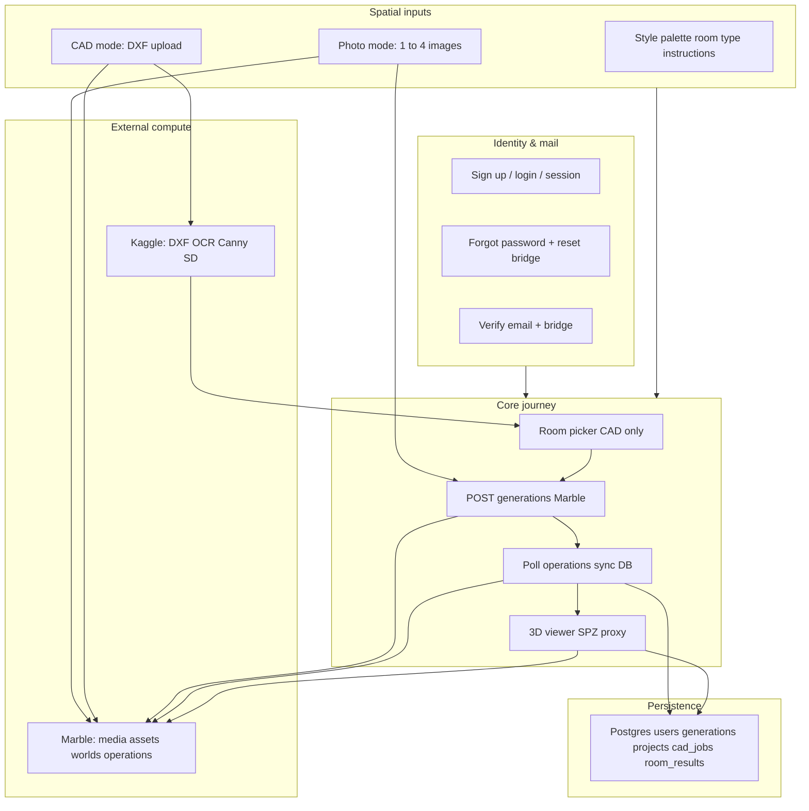

### Feature dependency (stack view)

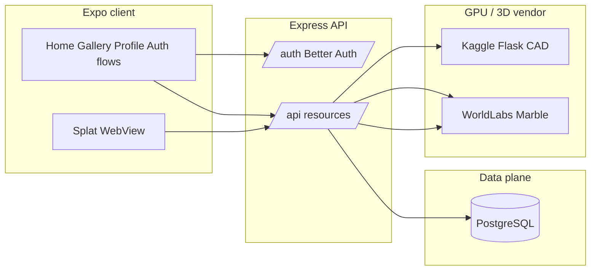

---

## Authentication flow (cookies & session)

Better Auth runs at **`/auth`** (`basePath: "/auth"` in `middleware/better-auth.ts`). Sessions are stored in **Postgres** (Better Auth’s tables via the same `pg` **`pool`** as Drizzle). The API enforces identity with **`auth.api.getSession({ headers })`**, which reads the **`Cookie`** header the client sends.

### What is the session cookie?

On **successful sign-in** (or sign-up), Better Auth issues **`Set-Cookie`** response header(s) for the session. The exact **cookie name(s)** and **format** are defined by Better Auth (versioned); they are **opaque** to application code. What matters in this repo:

- **Web (Expo web):** the **browser cookie jar** on the **API origin** (`EXPO_PUBLIC_API_URL` / `BETTER_AUTH_URL` host) stores these cookies. They are sent automatically on same-origin or CORS requests when **`credentials: "include"`** is used.
- **Native (iOS / Android):** **`@better-auth/expo`** + **`expoClient`** stores the cookie string in **Expo SecureStore** (encrypted device storage). **`apiFetch`** reads it via **`authClient.getCookie()`** and sets the request header **`Cookie: ...`** manually (see `mobile/lib/api.ts`).

Cookies are typically **`HttpOnly`** (not readable from JS on web) for security; only the **browser** or the **Expo plugin** manages the value.

### Session lifetime (this project)

From `better-auth.ts`:

- **`session.expiresIn`**: **30 days** — absolute ceiling for session validity (sliding behavior follows Better Auth rules).
- **`session.updateAge`**: **24 hours** — how often the session “touches” / refreshes server-side when active.

Optional **`emailVerification`**, **`revokeSessionsOnPasswordReset`**, and **`trustedOrigins`** affect when cookies are accepted or invalidated.

### CORS + credentials (Express)

`server.ts` enables **`credentials: true`** on CORS and allows the **`Cookie`** header so browsers may send cookies to **`/auth`** and **`/api`**. **`trustedOrigins`** (see `env.ts`) lists **web origins**, **`BETTER_AUTH_URL`** origin, **`decor-ai://`**, and **`exp://…`** in development so Better Auth accepts those clients.

### Protected **`/auth`** requests

`routes/authRoutes.ts` forwards every **`/auth/*`** call to **`authController.handleAuthRequest`**, which rebuilds a **`fetch` Request** to **`auth.handler`**, copying incoming **`req.headers`** (including **`Cookie`**) into the Web `Headers` object. The handler’s response is written back to Express, with **`Set-Cookie`** lines forwarded via **`res.append`** (Better Auth may emit more than one cookie).

The mobile app uses the **same** **`baseURL`** and **`basePath`** as in `mobile/lib/auth-client.ts`.

### Protected API routes

`requireAuth` forwards **`req.headers`** as `Headers` into **`getSession`**. If a valid session cookie is present → **`req.user`** and **`req.authSession`** are set → **`requireUser`** in controllers.

### Diagram — sign-in and first API call (web vs native)

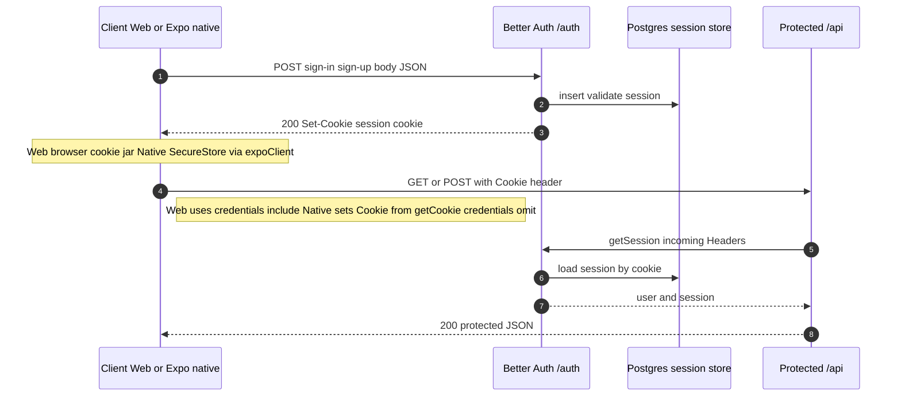

### Diagram — cookie path overview

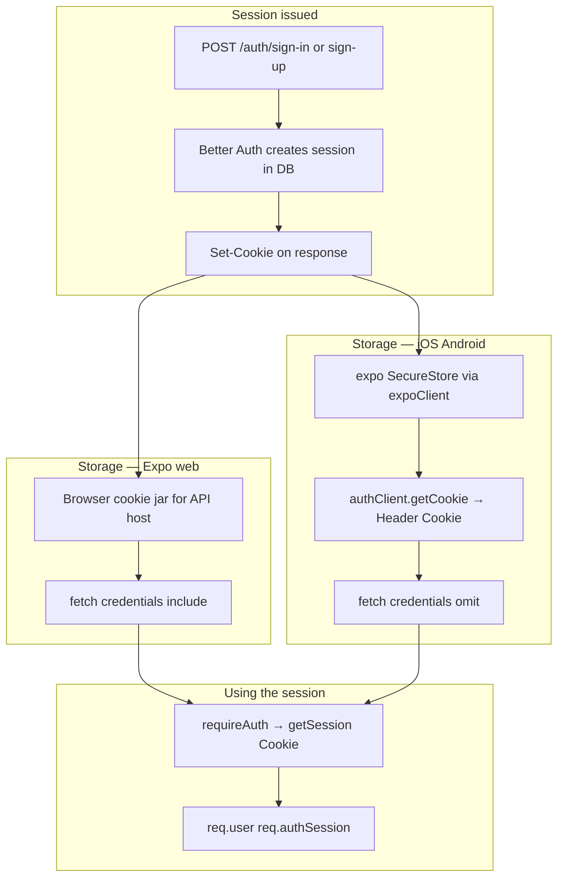

### Email links and bridges

Password reset and verify-email emails point at **HTTPS** URLs. **`/reset-mobile-bridge`** and **`/verify-email-mobile-bridge`** run **without** a session cookie in the mail client; they redirect into the **native app scheme** (`decor-ai://`) so the app can complete the flow on **`reset-password`** or **`verify-email-callback`** screens.

---

## Prerequisites

On any PC that runs this stack:

- **Node.js** 20+ (LTS recommended) and npm
- **PostgreSQL** (e.g. [Neon](https://neon.tech) serverless) — URL goes in `DATABASE_URL`
- **WorldLabs Marble** API key — [WorldLabs](https://worldlabs.ai)
- **Kaggle** account (free GPU sessions) — for DXF → rooms + 2D renders
- **ngrok** free account + auth token — so your laptop/phone can reach the notebook’s Flask server over HTTPS

Optional: **Resend** for production email (password reset / verify-email); dev can stay minimal per `backend/.env.example`.

---

## Quick start (local)

### 1. Clone and install

```bash
git clone <your-fork-or-repo-url>
cd decor-ai
npm install --prefix backend
npm install --prefix mobile
```

### 2. Backend environment

```bash
cd backend
cp .env.example .env     # macOS / Linux / Git Bash
# Windows (cmd/PowerShell): copy .env.example .env
```

Fill at least:

- `DATABASE_URL`, `BETTER_AUTH_SECRET` (≥32 chars), `BETTER_AUTH_URL` (e.g. `http://localhost:4000`)
- `WORLDLABS_API_KEY`
- `CAD_PIPELINE_URL` — **after** you start the Kaggle notebook (see below); can be empty until you test CAD

### 3. Database migrations

From `backend/`:

```bash
npm run db:migrate
# If you need baselining on an existing DB, see package.json script `db:migrate:safe`
```

### 4. Run the API

From repo **root**:

```bash
npm run dev:backend
```

Health: [http://localhost:4000/health](http://localhost:4000/health)  
JSON API: mounted under **`/api/*`**. Auth routes: **`/auth`**.

### 5. Mobile app

```bash
cd mobile
cp .env.example .env
# Windows: copy .env.example .env
```

Set `EXPO_PUBLIC_API_URL` to the same host/port as `BETTER_AUTH_URL` (for a **physical device**, use your PC’s **LAN IP**, e.g. `http://192.168.1.42:4000`, not `localhost`).

From repo root:

```bash
npm run dev:mobile
npm run android   # or: npm run ios / npm run web
```

---

## Kaggle notebook + ngrok (CAD pipeline)

The backend **does not** run Stable Diffusion or parse DXF locally. It forwards DXF bytes to the notebook’s **`POST /process`** endpoint.

### Notebook cell order (`notebooks/Pre-Phase AI.ipynb`)

1. **Dependencies** — installs `ezdxf`, EasyOCR, diffusers, Flask, `pyngrok`, OpenCV, etc.
2. **Cell 1** — defines `run_pipeline()` (DXF → rooms, Canny edges, ControlNet + Realistic Vision).
3. **Cell 2** — loads GPU models + defines **Flask** app with:
   - `GET /health`
   - `POST /process` (multipart field **`dxf_file`**, form fields `area_m2`, `style`, `palette`)
4. **Next cell** — starts **ngrok** on port **5000**, prints  
   `CAD_PIPELINE_URL=https://….ngrok-free.app`  
   then runs `app.run(host="0.0.0.0", port=5000)`.

   *(If the API returns “start … Cell C”, that refers to this **ngrok + Flask** cell: keep it running.)*

### What you must do on another PC

1. Upload or sync **`Pre-Phase AI.ipynb`** to **Kaggle** (or run locally with GPU + public tunnel — same idea).
2. Create an **ngrok account** and copy your **authtoken** from [ngrok dashboard](https://dashboard.ngrok.com/get-started/your-authtoken).
3. In the **ngrok + Flask** cell, set **`NGROK_TOKEN`** to your token (**never commit real tokens** to git).
4. Run cells in order; keep the **last running cell** alive (Flask + tunnel). If Kaggle stops the session (~30 minutes on free tier), the URL changes — update **`CAD_PIPELINE_URL`** and restart the backend.
5. Paste the printed base URL into **`backend/.env`**:

   ```env
   CAD_PIPELINE_URL=https://xxxx.ngrok-free.app
   CAD_PIPELINE_TIMEOUT_MS=180000
   ```

6. Restart **`npm run dev:backend`**.  
   Test from the PC: `curl <CAD_PIPELINE_URL>/health` should return JSON `status: ok`.

### Contract with the backend

The Express client (`backend/src/clients/cadPipeline.ts`) calls:

`POST {CAD_PIPELINE_URL}/process`

- **multipart** file field: **`dxf_file`**
- **form fields**: `area_m2`, `style`, `palette`

Success JSON shape (simplified): `{ "rooms": [ { "id", "name", "generated_image_b64", … } ] }`  
Errors: `{ "error": "…" }` → backend surfaces as 5xx / error message.

---

## API surface (high level)

All routes below are **under** `/api` except **`/auth`** and bridge pages at server root.

| Mount | Resource |
|-------|----------|
| `/api/uploads` | Image (and DXF-through-pipeline) uploads, Marble `prepare_upload` |
| `/api/cad-jobs` | `POST /process` (DXF job), `GET /:jobId/rooms` |
| `/api/generations` | Start Marble world generation |
| `/api/operations` | Poll Marble operation + sync `generations` row |
| `/api/worlds` | World metadata |
| `/api/projects` | User projects |

Authentication: **`router.use(requireAuth)`** on protected routers; session via **Better Auth** (cookies / Expo client).

---

## API design (detailed)

Design style: **resource-oriented HTTP API** on **`/api/*`**, plus **Better Auth** on **`/auth/*`**. Bodies are **JSON** unless noted (multipart upload, SPZ binary). Validation uses **Zod** schemas in **`backend/src/validation/*.ts`**. Responses on error are generally JSON with an **`error`** field (and sometimes **`details`**) via **`sendControllerError`** / **`errorHandler`**.

### Endpoint map (implemented routes)

| Method | Path | Auth | Request body / params | Notes |
|--------|------|------|------------------------|--------|
| **GET** | `/health` | No | — | Liveness JSON (`status`, `timestamp`, `service`). |
| **GET** | `/reset-mobile-bridge` | No | Query (bridge tokens / redirect params) | HTML → deep link to app (`MOBILE_APP_SCHEME`). |
| **GET** | `/verify-email-mobile-bridge` | No | Query | Same pattern for email verification. |
| **ALL** | `/auth/*` | Session cookie for session routes; none for sign-in | **JSON** on POST-like methods | Proxied to **Better Auth** `auth.handler` (`basePath` **`/auth`**). |
| **POST** | `/api/uploads` | **Yes** (`requireAuth`) | **multipart/form-data**: field **`file`**; validated **JSON** fields alongside (`uploadBodySchema`) | Max **20 MB**; images and **.dxf**; returns preview or Marble **`media_asset_id`**. |
| **GET** | `/api/generations` | **Yes** | — | Paginated list cap in service (e.g. last 50 generations for user). |
| **POST** | `/api/generations` | **Yes** + **generationCreateLimiter** | **JSON** `generateBodySchema` (`prompt`, `media_asset_ids`, `quality`, `input_mode`, `cad_options`, …) | **201** `{ operation_id, generation_id }`; calls Marble **`worlds:generate`**. |
| **GET** | `/api/operations/:operationId` | **Yes** | `operationId` opaque string max 512 (params) | Returns Marble **operation** JSON; may **sync** `generations` (`world_id`, `spz_urls`, status). |
| **GET** | `/api/worlds/:worldId/spz/:quality` | **Yes** | Params: **`quality`** ∈ `100k` \| `500k` \| `full_res`; query **`operationId`** optional | **Binary SPZ** (`Content-Type` from upstream); **`X-SPZ-Quality`** header. **Register before** `/:worldId` in router. |
| **GET** | `/api/worlds/:worldId` | **Yes** | `worldId` string | Marble **world** JSON; ownership via **`resolveGenerationForWorld`**. |
| **GET** | `/api/projects` | **Yes** | — | `{ projects }` for current user. |
| **POST** | `/api/projects` | **Yes** | **JSON** `createProjectSchema` | **201** project row. |
| **DELETE** | `/api/projects/:id` | **Yes** | `id` **UUID** | **204** on success. |
| **POST** | `/api/cad-jobs/process` | **Yes** | **multipart**: **`dxf_file`**; **JSON** fields `area_m2`, `style`, `palette` (`cadProcessBodySchema`) | Max **30 MB** DXF; **503** if `CAD_PIPELINE_URL` unset; **201** process response with rooms. |
| **GET** | `/api/cad-jobs/:jobId/rooms` | **Yes** | `jobId` **UUID** | Job status + room list (mapper); **403** if job not owned by user. |

**CORS** (from `server.ts`): **`credentials: true`**, methods **GET, POST, PUT, DELETE, OPTIONS**, allowed headers include **`Cookie`**, **`Authorization`**, **`Content-Type`**. **Global** rate limit: **200** requests / **15** minutes per IP.

---

### Diagram — HTTP surface (groups)

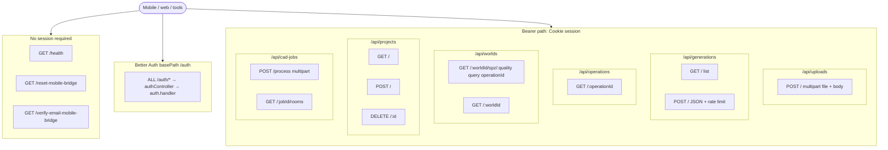

---

### Diagram — request pipeline (`/api/*` only)

How a protected API request moves through **`createApp`** and a resource router (conceptual; order matches `server.ts` + each `routes/*.ts`).

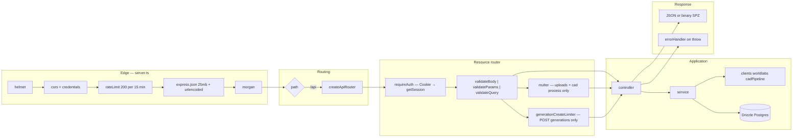

---

### Diagram — resource relationships (API view)

What each **primary resource** identifies in downstream systems (not full ERD; see **Database ERD** below).

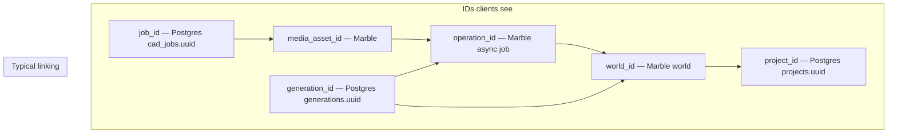

---

## User flows (mobile + backend)

End-to-end journeys for the **Expo** app (tabs, file picker, room picker, result, 3D viewer) and how they call **`/auth`** and **`/api/*`**. Arrows are **happy paths**; errors surface as alerts / API messages.

### Main journey map

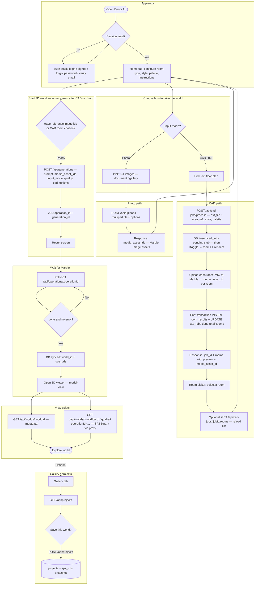

### Sequence — CAD → room → world → SPZ (detail)

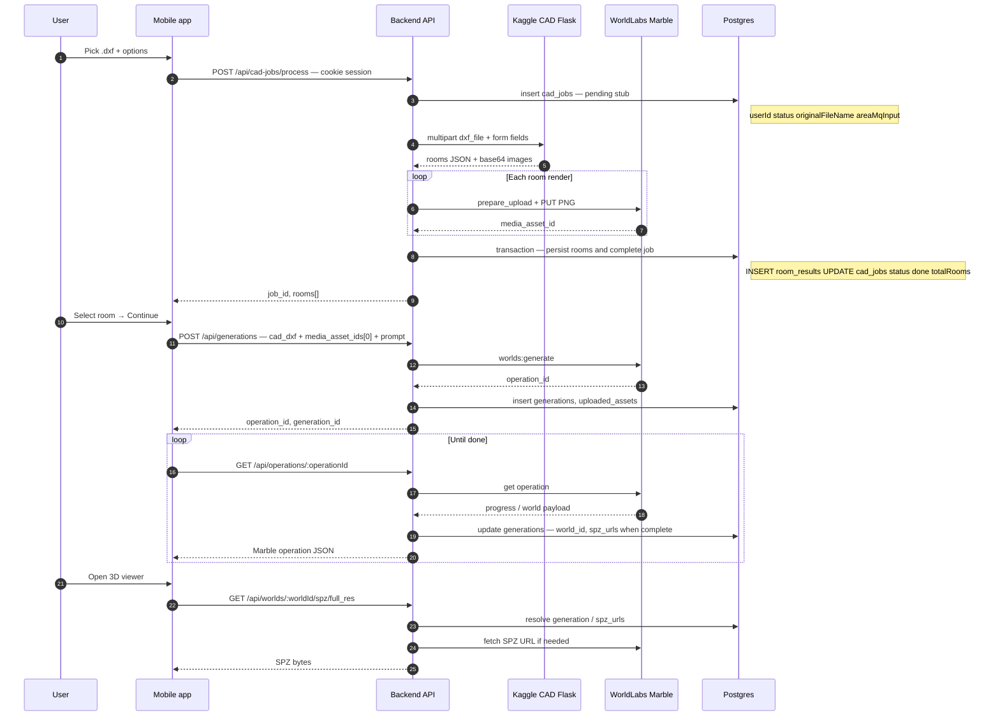

### Auth and email bridges

```mermaid
flowchart LR
  subgraph account["Account lifecycle"]
    S[Signup / Login] --> BA["/auth/* — Better Auth"]
    BA --> Cookie[Session cookie — Expo client]
    F[Forgot password email] --> Link[HTTPS link — often /reset-mobile-bridge]
    Link --> Bridge[Backend sets deep link]
    Bridge --> AppReset[App opens reset-password]
    V[Verify email email] --> VLink[/verify-email-mobile-bridge]
    VLink --> AppVerify[verify-email-callback screen]
  end
```

### Legend

| Layer | Responsibility |
|--------|----------------|
| **Mobile** | File pickers, form state, `apiFetch` with credentials, navigation (`room-picker/[jobId]`, `result/[operationId]`, `model-view/[worldId]`). |
| **Backend** | AuthZ, validation, orchestration; **does not** run SD/DXF math — **Kaggle** does for CAD. |
| **DB** | Jobs, rooms, generations, **SPZ URL map** (not the SPZ file itself). |

---

## API layer detail (routes → controllers → services)

Flow: **Express `Router`** (`routes/*.ts`) applies **middleware** (`requireAuth`, `multer`, `validateBody` / `validateParams` / `validateQuery`, rate limits) → **controller** (`controllers/*.ts`) parses `req` / calls **`sendControllerError`** on failure → **service** (`services/**/*.ts`) orchestrates **DB** (`db/client`, `schema`), **clients** (`clients/worldlabs/*`, `clients/cadPipeline.ts`), and **mappers** (`mappers/*`).

### Other server entry points (not under `/api`)

| HTTP | Path | Handler | Role |
|------|------|---------|------|
| GET | `/health` | inline in `server.ts` | Liveness JSON |
| GET | `/reset-mobile-bridge` | `resetBridgeController` | Password-reset deep link → app scheme |
| GET | `/verify-email-mobile-bridge` | `verifyEmailBridgeController` | Email verification → app |
| ALL | `/auth/*` | `authRoutes` → **`authController.handleAuthRequest`** | Proxies to **Better Auth** `auth.handler` (sessions, sign-in, OAuth, etc.) — **no** `services/` module |

### Protected API — route → controller → service

| Method | Full path | Middleware (typical order) | Controller | Service(s) | External / persistence |
|--------|-----------|---------------------------|------------|------------|------------------------|
| POST | `/api/uploads/` | `requireAuth` → `multer.single("file")` → `validateBody(uploadBodySchema)` | `uploadsController.postUpload` | **`processUpload`** | **WorldLabs** `prepareUpload` + `uploadFileToSignedUrl`; optional **CAD** `convertDxfViaCadPipeline` for `.dxf` |
| GET | `/api/generations/` | `requireAuth` | `generationsController.listGenerations` | **`listGenerationsForUser`** | **Postgres** `generations` |
| POST | `/api/generations/` | `requireAuth` → **`generationCreateLimiter`** → `validateBody(generateBodySchema)` | `generationsController.postGenerate` | **`createWorldGeneration`** | **WorldLabs** `generateWorld`; **Postgres** `generations`, `uploaded_assets` |
| GET | `/api/operations/:operationId` | `requireAuth` → `validateParams(operationIdParamSchema)` | `operationsController.getOperationById` | **`getOperationWithGenerationSync`** | **WorldLabs** `getOperation`, `getWorld`; **Postgres** `generations` update on sync |
| GET | `/api/worlds/:worldId/spz/:quality` | `requireAuth` → `validateParams` + `validateQuery(spzQuerySchema)` | **`spzController.getWorldSpz`** | **`proxyWorldSpzAsset`** | **`resolveGenerationForWorld`** + **WorldLabs** + HTTP fetch of SPZ blob |
| GET | `/api/worlds/:worldId` | `requireAuth` → `validateParams(worldIdParamSchema)` | `worldsController.getWorldDetail` | **`getWorldDetailForUser`** | **`resolveGenerationForWorld`** + **WorldLabs** `getWorld` |
| GET | `/api/projects/` | `requireAuth` | `projectsController.getProjects` | **`listProjectsForUser`** | **Postgres** `projects` |
| POST | `/api/projects/` | `requireAuth` → `validateBody(createProjectSchema)` | `projectsController.postProject` | **`createProjectForUser`** | **Postgres** `projects`, `generations` lookup |
| DELETE | `/api/projects/:id` | `requireAuth` → `validateParams(projectIdParamSchema)` | `projectsController.deleteProject` | **`deleteProjectForUser`** | **Postgres** `projects` |
| POST | `/api/cad-jobs/process` | `requireAuth` → `multer.single("dxf_file")` → `validateBody(cadProcessBodySchema)` | `cadJobsController.postCadProcess` (+ **`isCadPipelineConfigured`** check) | **`processCadDxfJob`** | **CAD HTTP** `convertDxfViaCadPipeline`; **WorldLabs** upload per room; **Postgres** `cad_jobs`, `room_results` |
| GET | `/api/cad-jobs/:jobId/rooms` | `requireAuth` → `validateParams(cadJobIdParamSchema)` | `cadJobsController.getCadRooms` | **`getCadJobRoomsForUser`** + **`mappers/cadJobRooms`** | **Postgres** `cad_jobs`, `room_results` |

> **Route ordering:** In `worldsRoutes`, **`/:worldId/spz/:quality`** is registered **before** **`/:worldId`** so `spz` is not parsed as a world id.

### Diagram — mounts and handlers

```mermaid
flowchart TB
  subgraph uploads["/api/uploads"]
    UR[uploadsRoutes]
    UC[uploadsController.postUpload]
    US[services/uploads/processUpload]
    UR --> UC --> US
  end

  subgraph gen["/api/generations"]
    GR[generationsRoutes]
    GL[generationsController.listGenerations]
    GP[generationsController.postGenerate]
    GLS[services/worlds/worldService.listGenerationsForUser]
    GCG[services/generations/createGeneration]
    GR --> GL --> GLS
    GR --> GP --> GCG
  end

  subgraph ops["/api/operations"]
    OR[operationsRoutes]
    OC[operationsController.getOperationById]
    OS[services/operations/operationService.getOperationWithGenerationSync]
    OR --> OC --> OS
  end

  subgraph worlds["/api/worlds"]
    WR[worldsRoutes]
    WC[worldsController.getWorldDetail]
    WS[services/worlds/worldService.getWorldDetailForUser]
    SC[spzController.getWorldSpz]
    SS[services/spz/proxyWorldSpz]
    WR --> WC --> WS
    WR --> SC --> SS
  end

  subgraph proj["/api/projects"]
    PR[projectsRoutes]
    PCG[projectsController.getProjects]
    PCP[projectsController.postProject]
    PCD[projectsController.deleteProject]
    PSL[listProjectsForUser]
    PSC[createProjectForUser]
    PSD[deleteProjectForUser]
    PR --> PCG --> PSL
    PR --> PCP --> PSC
    PR --> PCD --> PSD
  end

  subgraph cad["/api/cad-jobs"]
    CR[cadJobsRoutes]
    CP[cadJobsController.postCadProcess]
    CG[cadJobsController.getCadRooms]
    CPS[services/cadJobs/processDxfJob]
    CGR[services/cadJobs/getCadJobRooms]
    CR --> CP --> CPS
    CR --> CG --> CGR
  end

  subgraph authn["/auth"]
    AR[authRoutes ALL /*]
    AH[authController.handleAuthRequest]
    BA[better-auth handler]
    AR --> AH --> BA
  end
```

### Diagram — services to integrations (downstream)

`getWorldDetailForUser` and `proxyWorldSpzAsset` both call **`resolveGenerationForWorld`** (DB) before talking to Marble.

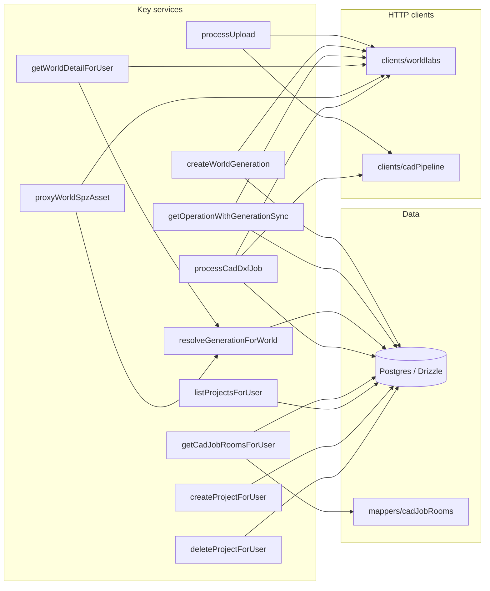

---

## Database ERD

Schema source: `backend/src/db/schema.ts` (Drizzle). Column names in **Postgres** are snake_case where noted.

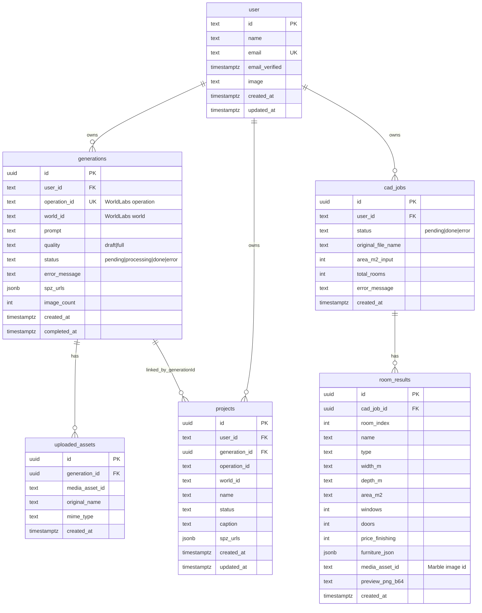

---

## Backend architecture

Simplified view of `backend/src/` using four logical layers. **Dependency rule:** **presentation** and **application** call **domain** shapes and **infrastructure** adapters; **domain** does not import **infrastructure** (mappers may depend on schema types and external DTO types declared as data).

### Layer diagram

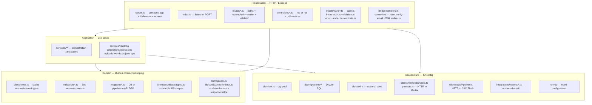

### Folder → layer (quick reference)

| Layer | `backend/src/` folders / files | Role |
|--------|-------------------------------|------|
| **Presentation** | `routes/`, `controllers/`, `middleware/` (except **Better Auth wiring** note below), `server.ts`, `index.ts` | Routing, auth gate, validation **middleware**, HTTP errors to JSON, bridges. |
| **Application** | `services/` | One service module per feature; coordinates DB + clients + mappers. |
| **Domain** | `db/schema.ts`, `validation/`, `mappers/`, `lib/`, `clients/worldlabs/types.ts` | Data model, request schemas, response mapping, shared errors; **no** raw `fetch` / pool here. |
| **Infrastructure** | `db/client.ts`, `db/migrations/`, `db/seed.ts`, `clients/` (**except** `types.ts` as pure types — still “contract” domain-adjacent), `integrations/`, `env.ts` | Persistence, outbound HTTP, email, environment. |

**Note:** `middleware/better-auth.ts` **configures** Better Auth with `pool` and `env` — it sits on the border of **presentation** (session API) and **infrastructure** (DB + secrets). It is listed under **presentation** in the diagram for “where sessions attach to HTTP.”

### Dependency sketch

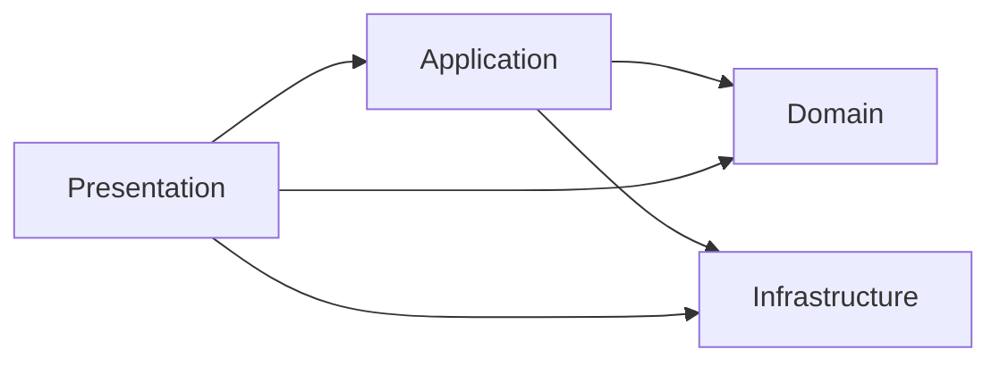

---

## End-to-end data flow (CAD → Marble → 3D)

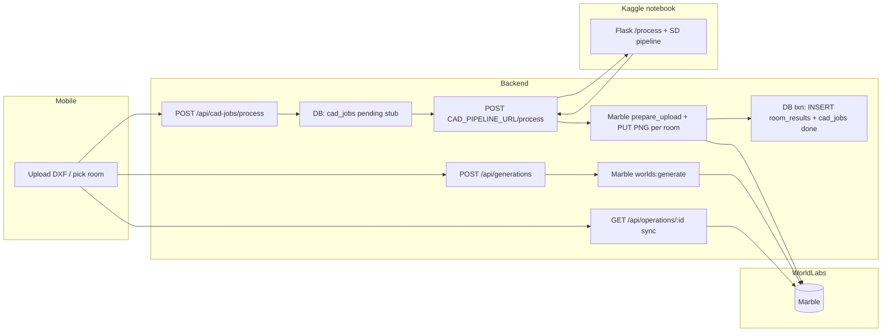

---

## Useful backend scripts

From `backend/`:

| Script | Purpose |
|--------|---------|
| `npm run dev` | `tsx watch` dev server |
| `npm run build` / `npm start` | Production build + `node dist` |
| `npm run db:migrate` | Apply Drizzle migrations |
| `npm run db:studio` | Drizzle Studio (inspect DB) |
| `npm run db:ensure-room-preview` | Repair column usage if `preview_png_b64` missing on old DBs |

---

## Troubleshooting

| Issue | What to check |
|-------|----------------|
| **`503` CAD pipeline** | `CAD_PIPELINE_URL` empty; Kaggle cell not running; ngrok URL expired — re-run tunnel cell, update `.env`, restart backend |
| **Fetch timeout to Kaggle** | Increase `CAD_PIPELINE_TIMEOUT_MS`; DXF large or many rooms slows SD |
| **Mobile login / CORS** | `BETTER_AUTH_URL` and `EXPO_PUBLIC_API_URL` same scheme+host; physical device needs **LAN IP**; `CORS_ORIGINS` includes your Expo web origin if applicable |
| **`room_results.preview_png_b64`** | Run `npm run db:ensure-room-preview` from `backend/` |

---

## Security note

Prefer **not** committing real **`backend/.env`** / **`mobile/.env`** files if the repository is shared or public. Use **`.env.example`** as the template and inject secrets via your host or CI. If secrets were ever pushed, **rotate** API keys and database credentials.
