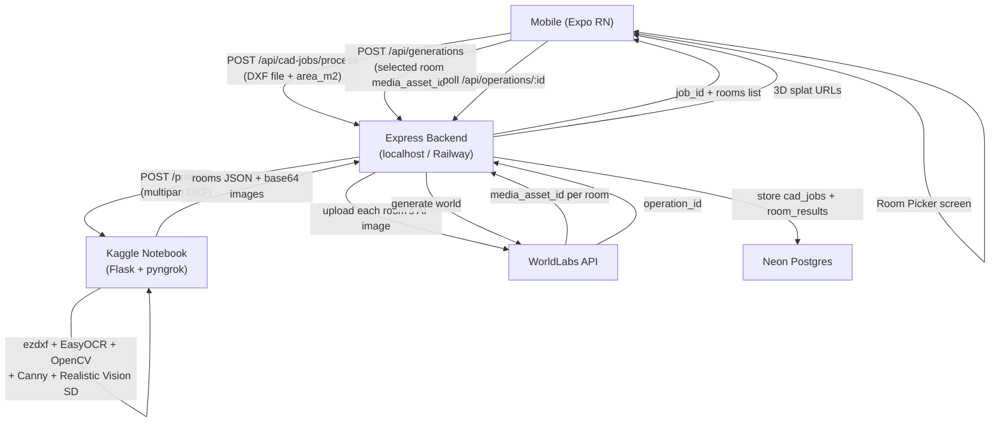

# Decor AI Monorepo (Backend + Mobile)

This repo now contains:

- `backend/` — Express + TypeScript API
- `mobile/` — Expo React Native app

## Run from repo root

```bash
npm run dev:backend
npm run dev:mobile
```

Optional mobile targets:

```bash
npm run android
npm run ios
npm run web
```

## Build backend

```bash
npm run build:backend
```

## Database (Neon)

If `room_results.preview_png_b64` is missing on a database (e.g. new environment), run from `backend/`:

```bash
npm run db:ensure-room-preview
```

## Full data flow


